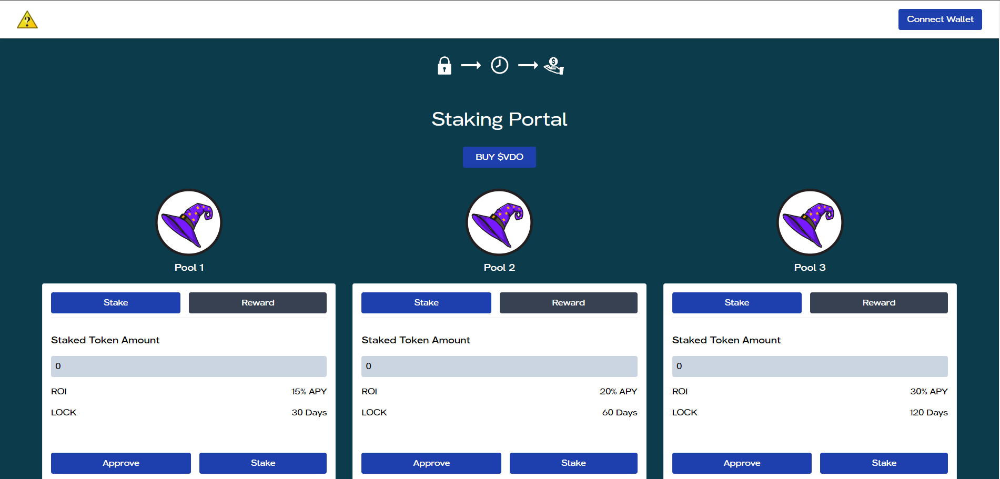

# Token Staking Pools DApp on PulseChain

Welcome to the Token Staking Pools DApp, a revolutionary platform on PulseChain, meticulously crafted by Decypher Labs. This DApp empowers users to stake their Voodoo tokens in one of six distinct pools, offering the opportunity to earn Magic or Poison tokens as rewards. With lock periods ranging from 30 days to 120 days and varying APYs, our platform is designed to cater to diverse investor preferences, optimizing your staking strategy.

## About Decypher Labs

Decypher Labs is at the forefront of blockchain innovation, creating decentralized applications that redefine user engagement and investment on the blockchain. Our dedication to transparency, security, and user-centric development is exemplified in the Token Staking Pools DApp, offering a robust platform for staking on PulseChain.

## Features

- **Multiple Staking Pools**: Choose from six pools to stake your Voodoo tokens.
- **Diverse Rewards**: Earn Magic tokens in three pools and Poison tokens in the other three.
- **Varying Lock Periods**: Select from lock periods of 30, 60, or 120 days.
- **Competitive APYs**: Benefit from varying APYs tailored to each pool’s lock period and reward type.
- **Seamless Integration**: Easy-to-use interface with PulseChain wallets for a straightforward staking process.

## Getting Started

### Prerequisites

- Ensure you have a web3-enabled browser and a PulseChain-compatible wallet with Voodoo tokens.

### How to Stake

1. **Connect Your Wallet**: Navigate to the [Token Staking Pools DApp website](#) and connect your PulseChain wallet.

2. **Choose a Pool**: Select one of the six staking pools based on your preferred reward type and lock period.

3. **Stake Your Voodoo Tokens**: Enter the amount of Voodoo tokens you wish to stake and confirm your selection.

4. **Earn Rewards**: Accumulate Magic or Poison tokens as rewards based on the pool’s APY and your staked amount.

5. **Claim Rewards**: After the lock period, claim your earned rewards directly to your wallet.

## Pool Details

- **Magic Token Pools**:
  - 30-day lock period: 15% APY
  - 60-day lock period: 20% APY
  - 120-day lock period: 30% APY

- **Poison Token Pools**:
  - 30-day lock period: 15% APY
  - 60-day lock period: 20% APY
  - 120-day lock period: 30% APY

## Smart Contract

Our DApp operates through secure smart contracts on PulseChain. For transparency and trust, the smart contract code is available for review in this repository.

## Interface Overview

Below is a screenshot of the Token Staking Pools DApp interface, providing a glimpse into the user-friendly design and functionality you can expect:

This interface has been thoughtfully designed to ensure a seamless staking experience, from pool selection to reward collection.

